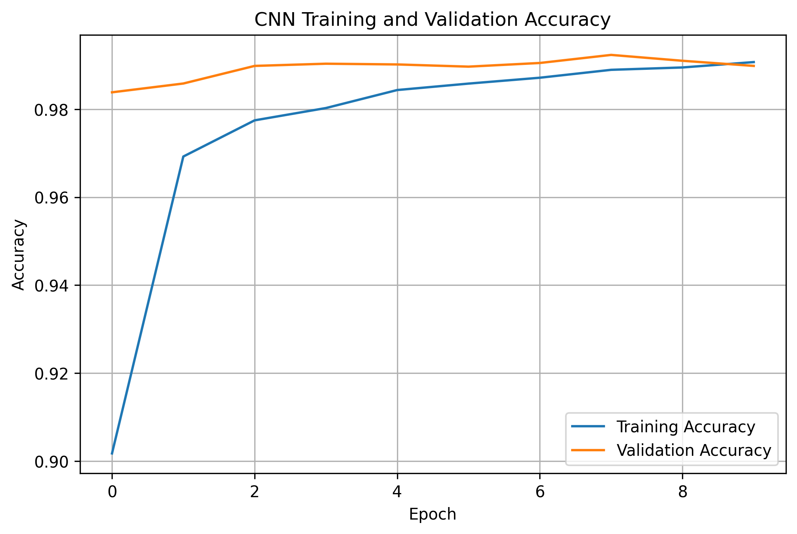
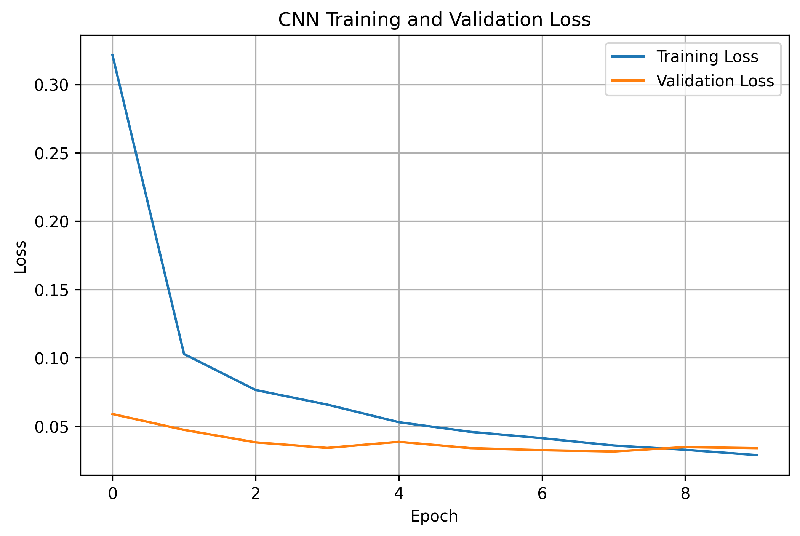
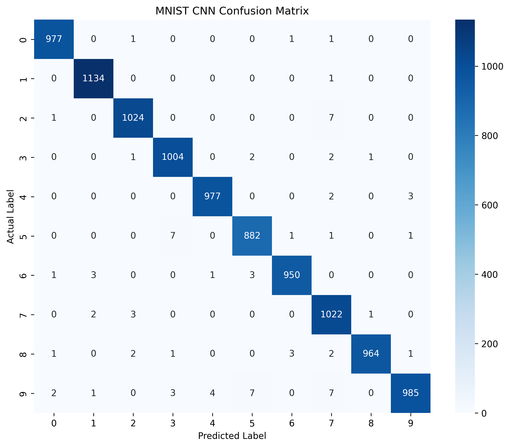

<div align="center">

# ✦ Digit AI

### Handwritten Digit Recognition using Deep Learning

**Draw a digit. Let the neural network understand it.**

A production-style computer vision project powered by  
**Convolutional Neural Networks · TensorFlow · Keras · MNIST · Streamlit**

<br>

[](https://www.python.org/)
[](https://www.tensorflow.org/)
[](https://keras.io/)
[](https://streamlit.io/)
[](https://yann.lecun.com/exdb/mnist/)
[](LICENSE)

<br>

[**Live Demo**](#-live-demo) ·
[**Architecture**](#-system-architecture) ·
[**Results**](#-model-performance) ·
[**Installation**](#-installation) ·
[**Contributing**](#-contributing)

</div>

---

## ✦ The Idea

**Digit AI** is an interactive handwritten digit recognition system that combines
deep learning with a minimal, intuitive user experience.

Instead of uploading an image, users can simply **draw a digit directly on the
screen**. The application captures the drawing, transforms it into a format
understood by the neural network, and produces a real-time prediction.

The system doesn't only return the predicted digit.

It also explains the prediction through:

- 🎯 Predicted digit
- 📊 Confidence score
- 📈 Probability distribution across all 10 classes
- 🖼️ Processed image seen by the model
- 🧠 CNN-based classification

The project covers the complete machine learning lifecycle:

```text
Data
  ↓
Preprocessing
  ↓
CNN Design
  ↓
Training
  ↓
Evaluation
  ↓
Model Serialization
  ↓
Inference Pipeline
  ↓
Interactive Web Application
  ↓
Real-Time Prediction
```
## ✦ The Idea
```
Handwritten-Digit-Recognition/
│
├── 📄 README.md
├── 📄 CONTRIBUTING.md
├── 📄 LICENSE
├── 📄 requirements.txt
├── 📄 .gitignore
│
├── 🐍 app.py
│
├── 📁 model/
│   └── digit_model.keras
│
├── 📁 src/
│   ├── __init__.py
│   ├── preprocess.py
│   └── predict.py
│
├── 📁 notebooks/
│   └── training.ipynb
│
├── 📁 assets/
│   ├── architecture.png
│   ├── input.png
│   ├── prediction.png
│   ├── probability.png
│   └── training.png
│
└── 📁 results/
    ├── accuracy.png
    ├── loss.png
    └── confusion_matrix.png

```
## ✦ Learning Outcomes
```
Python
 │
 ├── NumPy
 └── Pillow
 │
 ▼
Machine Learning
 │
 ├── Image Processing
 ├── Classification
 └── Evaluation
 │
 ▼
Deep Learning
 │
 ├── CNN
 ├── ReLU
 ├── Pooling
 ├── Dense Layers
 ├── Dropout
 └── Softmax
 │
 ▼
Application Development
 │
 └── Streamlit
 │
 ▼
Engineering
 │
 ├── Git
 ├── GitHub
 ├── Modular Architecture
 └── Documentation

```
## ✦ Main Commands to Run this Project
```
# Clone
git clone https://github.com/YOUR_USERNAME/Handwritten-Digit-Recognition.git

# Enter project
cd Handwritten-Digit-Recognition

# Create environment
python -m venv venv

# Activate Windows
venv\Scripts\activate

# Install dependencies
pip install -r requirements.txt

# Run
streamlit run app.py

# Check changes
git status

# Stage changes
git add .

# Commit
git commit -m "Update project"

# Push
git push origin main

---
```
# ✦ Result Pipeline
```
```text
                    USER
                     │
                     ▼
              Draw Handwritten
                  Digit
                     │
                     ▼
              Image Capture
                     │
                     ▼
              Preprocessing
                     │
                     ▼
                 28 × 28
                   Image
                     │
                     ▼
                   CNN
                     │
                     ▼
              Softmax Output
                     │
                     ▼
          ┌──────────────────────┐
          │                      │
          ▼                      ▼
    Predicted Digit        Probability
                              Scores
          │                      │
          └──────────┬───────────┘
                     ▼
              Streamlit UI
                     │
                     ▼
        Prediction + Confidence
             + Probabilities

```
# ✦ Model Results

<div align="center">

| Training Accuracy | Training Loss |
|:---:|:---:|
|  |  |
| **Training & Validation Accuracy** | **Training & Validation Loss** |

<br>

| Confusion Matrix | Model Architecture |
|:---:|:---:|
|  |  |
| **Classification Performance** | **CNN Architecture** |

<br>

| User Input | AI Prediction |
|:---:|:---:|
|  |  |
| **Handwritten Digit Input** | **Predicted Digit & Confidence** |

<br>

| Probability Distribution |
|:---:|
|  |
| **Class-wise Prediction Probability** |

</div>
